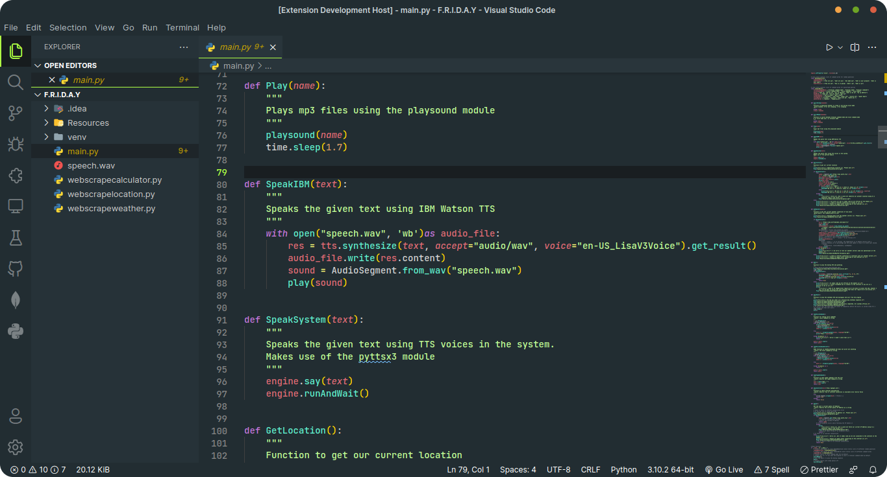
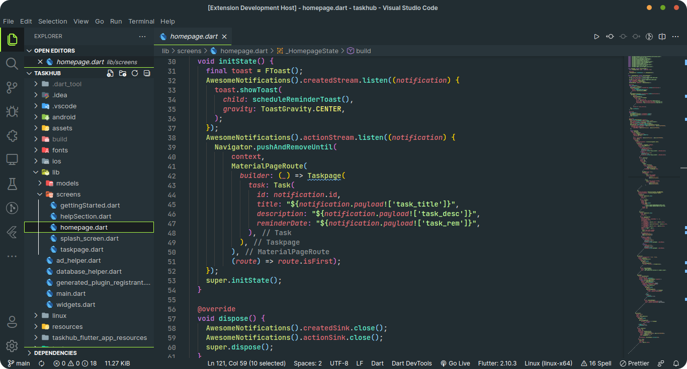
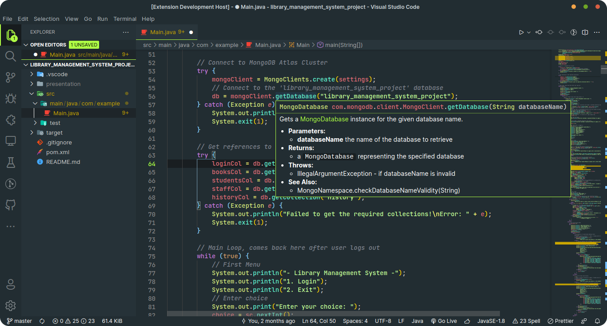

# Adapta Evergreen Theme

A VS Code color theme to go with my linux rice.

[](https://themes.vscode.one/)

## Screenshots







## Installing

Launch VS Code Quick Open (Ctrl+P), paste the following command, and press enter.

```bash
ext install adapta-evergreen-theme
```

## Recommended Extensions

These are some extensions from other publishers which I think complement this color theme well (I have used them in the above screenshots too!) .

- **[Material Icon Theme](https://marketplace.visualstudio.com/items?itemName=PKief.material-icon-theme)**
- **[Bracket Pair Colorizer 2](https://marketplace.visualstudio.com/items?itemName=CoenraadS.bracket-pair-colorizer-2)**
- **[Fluent Icons](https://marketplace.visualstudio.com/items?itemName=miguelsolorio.fluent-icons)**

## Adapta Evergreen Rice

This theme was made with an intention to complement my linux rice **[Adapta Evergreen Rice](https://github.com/sagar-alias-jacky/Adapta_Evergreen_Rice)** for KDE. Feel free to check it out if you are interested :)

## Override this theme (Customization)

To override this (or any other) theme in your personal config file, please follow the guide in the **[color theme](https://code.visualstudio.com/api/extension-guides/color-theme)** documentation. This is handy for small tweaks to the theme without having to fork and maintain your own theme.
